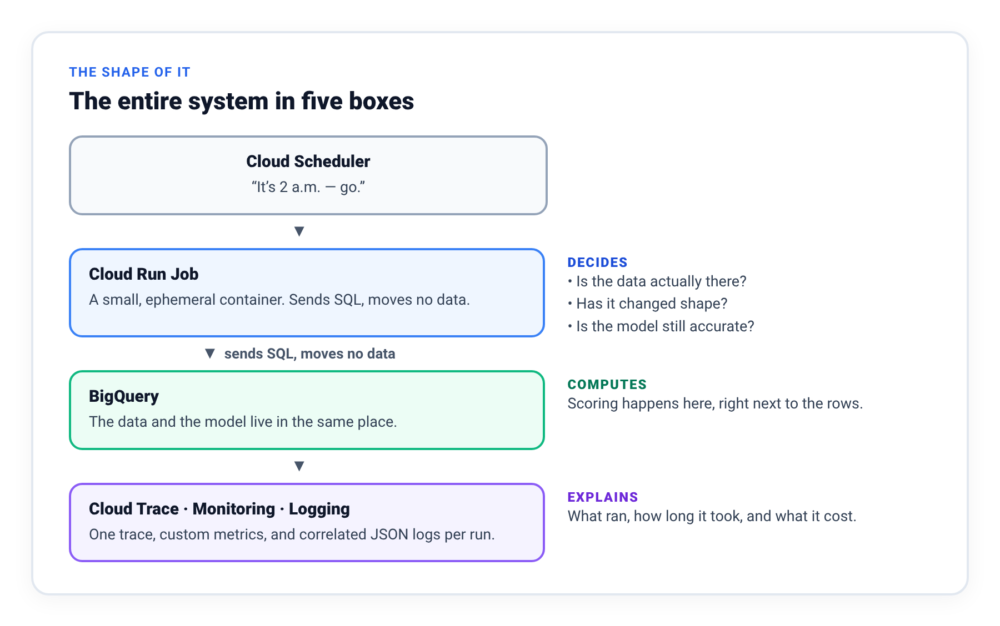
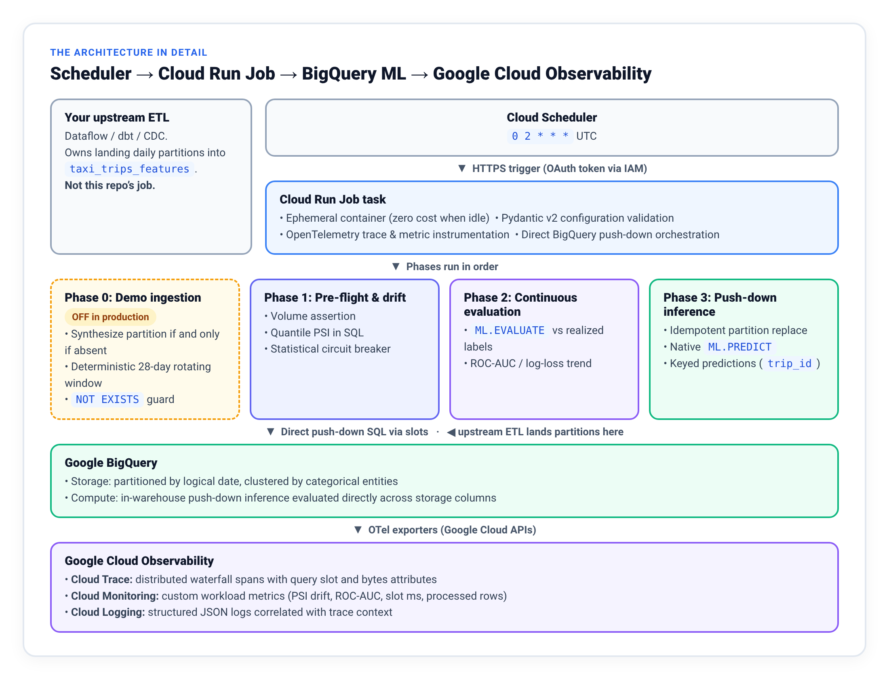
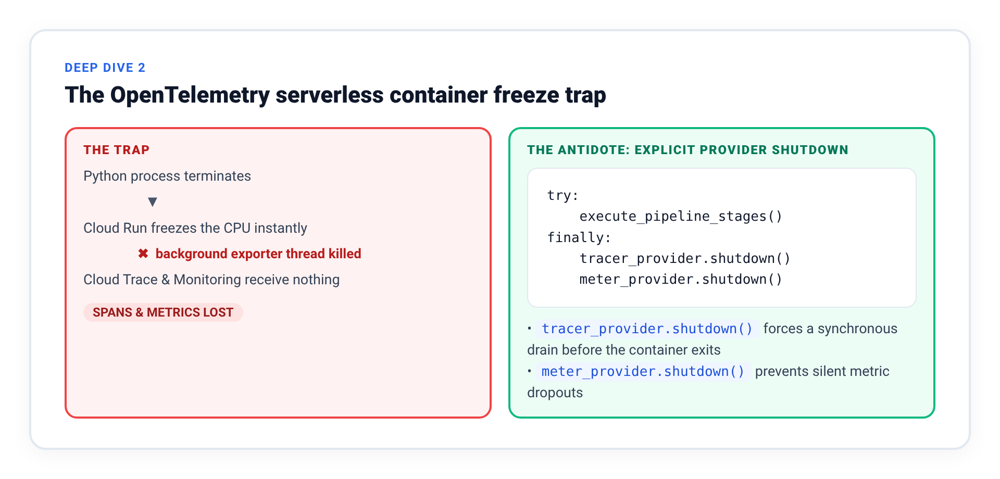
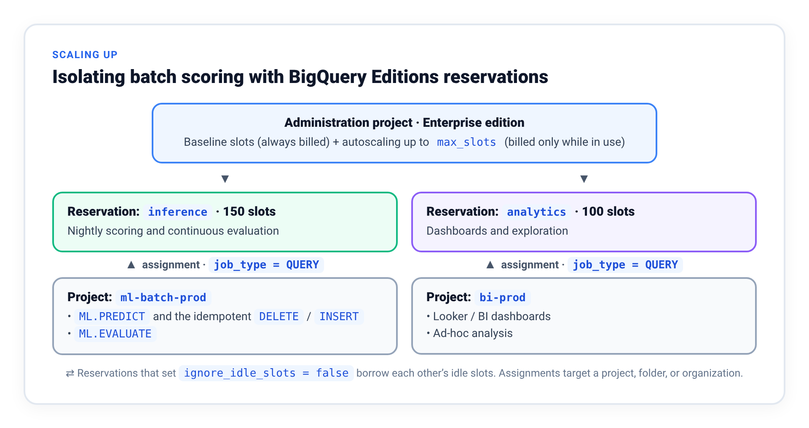

# The Zero-Cluster MLOps Blueprint: BigQuery ML, Cloud Run Jobs, and OpenTelemetry

> *Nightly ML scoring with no servers to patch, no clusters to size, and a distributed trace for every run.*

---

## TL;DR

This is a complete, deployed blueprint for nightly batch scoring on Google Cloud. BigQuery ML does the math where the data already lives, a short-lived Cloud Run Job enforces the guardrails around it, and OpenTelemetry records one distributed trace for every run. Everything is provisioned with Terraform, and the code is on GitHub.

* **About ten seconds of pipeline work per night** to score 68,891 trips, **$0.00 when idle**, and no cluster to patch.
* **A target leak lifted ROC-AUC from 0.77 to 0.81**, small enough to pass review. We show the check that catches it.
* **Cash trips are 100.0% zero-tip**, because the meter never sees a cash tip. Filtering them out recovered more than a third of the signal.
* **Closed PSI bins let 30% out-of-range data pass** the drift check. Open outer bins halt it.
* **118 offline tests run in about a second**, including contract tests that keep Terraform and Python in agreement.
* **Every run emails its own result:** `SUCCEEDED`, `HALTED`, or `FAILED`, with one line on what happened and what to do. A job that crashes, or never starts, sends an alert too.

**How to read it:**

* **Business and product leaders:** [The Problem](#the-problem), [Should You Do This At All?](#should-you-do-this-at-all), and the [Conclusion](#conclusion) (about 5 minutes).
* **Cloud and ML architects:** add [the data and its two bugs](#the-data-and-two-bugs-it-taught-us), [The Architecture in Detail](#the-architecture-in-detail), [Where Does the Data Come From?](#where-does-the-data-come-from), [Scaling Up: BigQuery Slot Reservations](#scaling-up-bigquery-slot-reservations), and [Known Limitations](#known-limitations--natural-extensions) (about 20 minutes).
* **Engineers implementing it:** read straight through. The [Deep Dives](#deep-dive-1-in-warehouse-push-down-inference), [Production Gotchas](#production-gotchas), and the [Console Verification Tour](#console-verification-tour) are written for you.
* **New to Google Cloud or MLOps:** start with [The Problem](#the-problem) and [The Shape of It](#the-shape-of-it). Every concept is defined the first time it appears.

---

## The Problem

Every night at 2 a.m., in almost every data-driven organization, a cluster wakes up. It pulls tens of millions of rows out of the data warehouse, loads them into memory, multiplies each row by a vector of model weights, writes the predictions back to a table, and shuts down.

Most nights, it works. It also costs an engineering team a day or two of maintenance every month. A minor Python library version drifts between the notebook that trained the model and the container that scores it, causing predictions to shift without throwing an error. A holiday traffic spike triggers an out-of-memory crash at 3 a.m. Or the cluster's monitoring dashboard stays completely green while the upstream table arrives half-empty, producing a truncated predictions table that nobody notices until a downstream business team complains.

The irony is that **the math was never the hard part.** Scoring a row with a logistic regression or a boosted tree is straightforward arithmetic. Everything else (sizing the cluster, keeping Python dependencies synchronized, tuning executor memory, carrying a pager for infrastructure) is overhead we pay because we default to moving data out of the warehouse to score it.

Pulling data out of BigQuery just to run `model.predict()` introduces three recurring costs:

1. **You pay to move bytes that never needed to move.** Most of the wall-clock runtime goes to network egress and serialization across process boundaries, all to evaluate a dot product that the warehouse could run in place.
2. **You maintain a second runtime.** Even serverless Spark or custom batch containers require you to package a Python environment, pin libraries against your training environment, and tune memory headroom.
3. **Your telemetry is split across two worlds.** Container CPU and memory live in one dashboard while BigQuery slot consumption and data quality metrics live in another. When a nightly job suddenly takes four times longer than usual, engineers have to stitch logs together manually to find out whether the bottleneck is in Python or SQL.

This blueprint shows a practical alternative: **in-warehouse push-down inference orchestrated by an ephemeral serverless container.** *Push-down* means bringing the math to the data rather than hauling the data to the math. The model executes directly inside **BigQuery ML**, where the tables already live. A lightweight **Cloud Run Job** handles the control flow around those queries, while **OpenTelemetry** exports correlated traces and custom metrics into **Google Cloud Trace** and **Cloud Monitoring**.

**What you end up with:** a pipeline that scores yesterday's partition inside BigQuery every night, halts automatically if the input data is missing or has drifted, evaluates its own accuracy against fresh production outcomes, and records a single distributed trace covering the container and every SQL job it ran. Provisioned via Terraform. About ten seconds of pipeline work per night. $0.00 when idle.

> **Source Code & Infrastructure Templates**  
> The complete repository (Terraform modules, SQL templates, Dockerfile, test suite, and Python orchestrator) is available on GitHub:  
> 🔗 **[`github.com/Rajdipc/zero-cluster-mlops`](https://github.com/Rajdipc/zero-cluster-mlops)**

---

## The Shape of It

Before diving into SQL or Terraform, here is the entire system in five boxes:



Three practical rules govern how these components interact:

1. **The container makes decisions; BigQuery does the math.** Not a single feature row is pulled into container memory. The Python process submits SQL and reads back compact summary statistics (a row count, a drift score, an ROC-AUC value).
2. **The data already lives in BigQuery.** If your data sits in another store and you have to copy it into BigQuery just to score it, you lose the primary advantage of this design. See [Should You Do This At All?](#should-you-do-this-at-all).
3. **Upstream ingestion is a separate responsibility.** Drawing a hard line between the ETL job that lands the data and the job that scores it prevents silent data corruption. We cover that boundary in [Where Does the Data Come From?](#where-does-the-data-come-from).

The next section opens up the Cloud Run box: the four phases inside it, the drift circuit breaker, the idempotent write, and the OpenTelemetry export path.

---

## The Architecture in Detail

Here is the same system with the Cloud Run Job opened up into its four phases, alongside the upstream ETL that feeds it and the observability stack it reports to:



In plain terms: **Phase 1** checks that yesterday's data arrived and still looks like the data the model was trained on. **Phase 2** measures how accurate the model was on the most recent day whose real outcomes are known. **Phase 3** writes the new predictions. If Phase 1 fails, nothing is written.

Notice the separation on the left: your upstream ETL pipeline owns landing daily partitions into `taxi_trips_features`, while Phase 0 (the dashed box) only activates in demo mode when you are testing against the static 2022 public dataset. [Where Does the Data Come From?](#where-does-the-data-come-from) explains why that line matters.

---

## Should You Do This At All?

Most architecture articles only tell you why you should adopt a pattern. Knowing when *not* to use it saves far more engineering time. Two questions decide whether this blueprint fits your workload.

### Question 1: Does your data already live in BigQuery, and does your model fit SQL?

* **Where this pattern shines:** Structured tabular data, time series, and transactional event logs (gigabytes to petabytes) that already reside in BigQuery; scheduled batch cadences (hourly, daily, weekly); models supported natively by BigQuery ML (logistic and linear regression, boosted trees, DNNs, ARIMA+, PCA, K-means, matrix factorization, or imported ONNX/TensorFlow/XGBoost artifacts); and feature engineering that can be expressed in SQL.
* **When to reach for Vertex AI or Spark instead:** Unstructured modalities (computer vision, audio, raw video); real-time online inference requiring sub-50ms latency; custom PyTorch architectures or multi-GPU transformer pipelines; features that depend on third-party Python libraries; or datasets living outside BigQuery where moving the data in would recreate the exact data-movement tax we are trying to avoid.

### Question 2: Why use a Cloud Run container at all?

Let's address the most important architectural question upfront: **every SQL file in this repository can be run by a BigQuery Scheduled Query or a Dataform workflow** without building a Docker image or deploying a Cloud Run Job.

If your only requirement is *"run `ML.PREDICT` every night at 2 a.m. and append the results to a table,"* use a Scheduled Query or Dataform. It has fewer moving parts and takes ten minutes to set up.

Adding an ephemeral Cloud Run container is justified only when you need three capabilities that pure SQL scheduling does not cleanly provide:

1. **Imperative circuit breaking.** When input data drifts past a safe statistical threshold, you want the pipeline to log a structured error, emit a custom metric, and halt before writing corrupted predictions. Doing conditional branching and early exits in pure SQL scripts requires awkward `ASSERT` hacks that fail with opaque diagnostics.
2. **Unified distributed tracing.** BigQuery's `INFORMATION_SCHEMA.JOBS` is great for auditing individual queries, but it does not give you a single waterfall trace where the pre-flight check, the drift computation, the model evaluation, and the batch prediction appear as child spans of one run, each annotated with slot milliseconds and correlated by trace ID to structured JSON logs.
3. **Offline unit testing.** Date-window math, label-maturity lag, and configuration cross-checks are business logic. In Python, you can run 118 unit and contract tests in one second on a laptop with zero cloud access. In scheduled SQL, you usually discover bugs in production.

> 💡 **Bottom line:** The container is not there to process rows. It is there to enforce guardrails, manage control flow, and emit correlated telemetry while BigQuery does 100% of the heavy lifting.

### Quick Decision Matrix

| Requirement | This Blueprint (BQML + Cloud Run) | BigQuery Scheduled Query / Dataform | Vertex AI Batch / Serverless Spark |
| :--- | :---: | :---: | :---: |
| Tabular data already in BigQuery | ✅ | ✅ | ⚠️ Adds data movement |
| Halt automatically on feature drift | ✅ | ❌ | ✅ |
| Single distributed trace across phases | ✅ | ❌ | ⚠️ Partial |
| Arbitrary Python feature libraries | ❌ | ❌ | ✅ |
| Real-time online serving (< 50 ms) | ❌ | ❌ | ✅ |

---

## The Data, and Two Bugs It Taught Us

To keep the demo reproducible without proprietary data, the pipeline uses the public **NYC TLC Yellow Taxi Trips** table in BigQuery (`bigquery-public-data.new_york_taxi_trips.tlc_yellow_trips_2022`). The model is a BigQuery ML logistic regression that estimates whether a completed credit-card trip will earn a tip over $2.00, using four basic trip attributes: vendor, passenger count, distance, and base fare. Every night it scores the previous day's trips into a date-partitioned predictions table.

Two design rules matter more than the algorithm. Every prediction carries a deterministic join key, `trip_id`, hashed from the trip's natural attributes because the public table has no primary key, so downstream teams can join each score back to its trip. And the predictions table is partitioned by the logical date of the data (`scoring_date`), never by when the job ran. [Gotcha #1](#1-the-wall-clock-partition-key-trap) shows why.

Building on real data surfaced two bugs that have nothing to do with taxis. Both are summarized here. The queries, the full results, and the SQL fixes are in the [data notes runbook](https://github.com/Rajdipc/zero-cluster-mlops/blob/main/docs/data-notes.md).

### Bug 1: A Target Leak Small Enough to Pass Review

Our first feature set included `total_amount`. It compiled, passed the tests, and looked ordinary in review. But in the taxi schema, `total_amount` *includes* `tip_amount`, and the label is derived from `tip_amount`, so the model was being handed part of the answer.

The leak lifted holdout ROC-AUC only from **0.77 to 0.81**, and that is what makes it dangerous. A leak that pushes AUC to 0.99 gets questioned. One that nudges it to 0.81 looks respectable, passes review, and then fails in production, where the leaked column is not populated yet at prediction time.

The rule that catches it needs no query: **if a column is not available at the moment the decision is made, it cannot be a feature.** Three checks apply to any tabular dataset:

1. **Expand every composite column.** Write out the arithmetic definition of any `total_*`, `net_*`, `final_*`, or `_summary` column. If the label or a descendant of the label sits inside the formula, drop the column from your feature view.
2. **Plot columns on an event timeline.** Verify that every feature is recorded *before* the prediction timestamp.
3. **Test a one-line SQL heuristic.** If a simple subtraction or ratio of two features predicts the label with 85%+ accuracy, check whether you are measuring a post-event accounting identity rather than customer behavior.

The fix lives in one place. Training, evaluation, and inference all read the same canonical view, which no longer projects `total_amount`, and a regression test stops it from coming back. ([Full story](https://github.com/Rajdipc/zero-cluster-mlops/blob/main/docs/data-notes.md#3-bug-1-target-leakage-in-full))

### Bug 2: A Label That Was Never Recorded

When we grouped the zero-tip rate by payment type, cash trips came back **100.0% zero-tip**: not 99.8%, but every one of nearly a quarter of a million trips. Riders do not unanimously stiff their drivers. Taxi meters only record tips paid by card, so every cash tip is written as `0.00`.

Those trips were 22% of the training window, all labelled "no high tip" whatever the trip looked like. Filtering the canonical view to card payments recovered more than a third of the signal. It also sharpened what the model claims to answer: not *"Will this passenger tip?"* but **"Given a credit-card trip, will the tip exceed $2.00?"** ([Full story](https://github.com/Rajdipc/zero-cluster-mlops/blob/main/docs/data-notes.md#4-bug-2-the-unrecorded-label-in-full))

> 💡 **Takeaway for public and enterprise datasets:**  
> Before training a classifier, run a `GROUP BY` of your positive label rate across every major categorical dimension (`payment_type`, `channel`, `region`, `device_type`, `vendor`). Whenever a segment shows **0.0%** or **100.0%**, assume you have found an unrecorded logging path rather than customer behavior.

---

## Where Does the Data Come From?

Almost every batch ML tutorial glosses over how new partitions arrive. In production, **a batch scoring job scores a partition; it does not ingest raw data.** Your upstream ETL (Dataflow, Datastream, Fivetran, dbt, or Composer) owns landing each day's partition in `taxi_trips_features`, and retries and pages its own team when a load fails. This pipeline owns validating and scoring what landed. If the partition is missing or too small, it **halts with exit code `2`**, writes nothing, and fires an alert. It never fabricates data or scores a half-loaded table.

The shipped `MIN_ROW_COUNT = 1` is only a presence check, because a template cannot know your volumes. Against real data, set the floor to about half your median daily row count (for example, `make tf-apply MIN_ROW_COUNT=50000`) so partial loads are caught too.

Because the 2022 public dataset never gets new rows, the demo includes an optional **Phase 0** that fills a missing partition from a rotating window of February 2022 trips, without ever overwriting real data. Always deploy real environments with `ENABLE_DEMO_INGESTION=false`. The [data notes runbook](https://github.com/Rajdipc/zero-cluster-mlops/blob/main/docs/data-notes.md#6-phase-0-keeping-the-demo-alive-past-day-one) shows how Phase 0 works.

---

## Deep Dive 1: In-Warehouse Push-Down Inference

For engineers building or adapting this pattern, here are the core SQL mechanics that run inside BigQuery slots.

### 1. Computing Population Stability Index (PSI) in SQL

**Population Stability Index (PSI)** measures whether today's feature distribution has shifted compared to the baseline window the model was trained on. We divide the baseline distribution of `fare_amount` into 10 decile buckets using `APPROX_QUANTILES`, count what share of today's rows fall into each bucket, and sum `(actual_pct - expected_pct) * LN(actual_pct / expected_pct)`:

```sql
-- Extracted from: sql/calculate_psi.sql
WITH quantiles AS (
  SELECT percentiles
  FROM (SELECT APPROX_QUANTILES(feature_val, 10) AS percentiles FROM baseline_data)
),
bins AS (
  SELECT
    offset AS bin_id,
    percentiles[OFFSET(offset)]     AS min_val,
    percentiles[OFFSET(offset + 1)] AS max_val
  FROM quantiles, UNNEST(GENERATE_ARRAY(0, 9)) AS offset
),
scoring_counts AS (
  SELECT b.bin_id, COUNT(1) AS cnt
  FROM scoring_data d
  JOIN bins b
    -- The outer bins are OPEN-ENDED. bin 0 is (-inf, p10) and bin 9 is
    -- [p90, +inf), so a value outside the baseline's range still lands
    -- somewhere. See the callout below -- this line is load-bearing.
    ON (d.feature_val >= b.min_val OR b.bin_id = 0)
   AND (d.feature_val <  b.max_val OR b.bin_id = 9)
  GROUP BY b.bin_id
),
distributions AS (
  SELECT
    b.bin_id,
    -- Laplace smoothing (0.0001) prevents division by zero / undefined ln()
    COALESCE(bc.cnt / NULLIF(tc.total_b, 0), 0.0001) AS expected_pct,
    COALESCE(sc.cnt / NULLIF(tc.total_s, 0), 0.0001) AS actual_pct
  FROM bins b
  CROSS JOIN total_counts tc
  LEFT JOIN baseline_counts bc ON b.bin_id = bc.bin_id
  LEFT JOIN scoring_counts  sc ON b.bin_id = sc.bin_id
)
SELECT ROUND(SUM((actual_pct - expected_pct) * LN(actual_pct / expected_pct)), 4) AS total_psi
FROM distributions;
```

Two details in that query prevent subtle production bugs:

* **Laplace smoothing (`0.0001`):** If a decile bucket happens to receive zero rows on a given day, evaluating `LN(actual / expected)` throws a divide-by-zero / undefined-logarithm error right when a severe distribution shift is occurring. Coalescing empty buckets to `0.0001` keeps the math stable.
* **Open-ended outer buckets (`OR b.bin_id = 0` and `OR b.bin_id = 9`):** When `APPROX_QUANTILES` computes decile boundaries on your training baseline, bucket 0 starts at the baseline's minimum value and bucket 9 ends at the baseline's maximum value. If you write a closed join condition (`feature_val >= min_val AND feature_val < max_val`), any scoring row that falls *below* the historical minimum or *above* the historical maximum fails to match any bucket. It drops out of `scoring_counts` (the numerator) while still being counted in `total_s` (the denominator). As a result, every bucket's observed share shrinks slightly, and **PSI goes down as out-of-range drift gets worse.**

We simulated this exact scenario to measure the blind spot:

| Share of Partition Outside Baseline Range | Closed Outer Bins (Buggy) | Open Outer Bins (Shipped) |
| :--- | ---: | ---: |
| 5% out of range | 0.003 | 0.018 |
| 10% out of range | 0.011 | 0.067 |
| 20% out of range | 0.045 | 0.225 |
| **30% out of range** | **0.107 (Passes!)** | **0.450 (Halts ⛔)** |
| 50% out of range | 0.347 (Halts ⛔) | **1.077 (Halts ⛔)** |

With closed bins, nearly a third of your daily partition can shoot past the historical maximum and still return a PSI of `0.107`—cruising right past the `0.25` circuit breaker. Making bucket 0 (`(-∞, p10)`) and bucket 9 (`[p90, +∞)`) open-ended catches every out-of-range value in the tail buckets, pushing PSI to `0.450` and halting the pipeline.

### 2. Idempotent Push-Down Scoring (`DELETE` then `INSERT`)

To make every scoring run safe to repeat without duplicating rows, Phase 3 clears the target partition and repopulates it using two separate single-statement jobs (see [Gotcha #2](#2-the-idempotency-vs-telemetry-tradeoff) for why they are submitted separately):

```sql
-- Statement 1 (sql/delete_partition.sql) -- its own job
DELETE FROM `{project}.{dataset}.{predictions_table}`
WHERE scoring_date = {target_date_sql};
```

```sql
-- Statement 2 (sql/batch_inference.sql) -- its own job
INSERT INTO `{project}.{dataset}.{predictions_table}` (
  trip_id, scoring_date, vendor_id,
  predicted_is_high_tip, predicted_is_high_tip_probs, model_name, scored_at
)
SELECT
  trip_id,
  {target_date_sql} AS scoring_date,   -- the logical date scored
  vendor_id,
  predicted_is_high_tip,
  predicted_is_high_tip_probs,
  '{model_name}' AS model_name,        -- lineage across retrains
  CURRENT_TIMESTAMP() AS scored_at     -- audit only
FROM ML.PREDICT(
  MODEL `{project}.{dataset}.{model_name}`,
  (
    SELECT
      trip_id,                         -- passthrough join key, not a feature
      vendor_id, passenger_count, trip_distance, fare_amount
      -- total_amount excluded: it contains the label, and it is not knowable
      -- at prediction time. The view does not project it at all.
    FROM `{project}.{dataset}.{feature_view}`
    WHERE scoring_date = {target_date_sql}   -- partition pruning
  )
);
```

Notice how `trip_id` passes straight through `ML.PREDICT` without being used as a model feature, preserving our join key on every output row, while `scoring_date` is populated from `{target_date_sql}` so backfills always land in the partition of the data they scored.

> 📂 *All SQL templates and DDL scripts live in [`/sql`](https://github.com/Rajdipc/zero-cluster-mlops/tree/main/sql).*

---

## Deep Dive 2: Serverless Orchestration & OpenTelemetry

Cloud Run Jobs start in seconds, run to completion, and scale to zero. However, instrumenting short-lived serverless batch containers with OpenTelemetry introduces a classic lifecycle trap:



### 1. Flushing Telemetry Before Cloud Run Freezes the CPU

In a long-running web server, OpenTelemetry background threads batch and export spans every few seconds automatically. In a Cloud Run Job, **the instant your Python `main()` function exits, Cloud Run throttles the container CPU to zero**—killing background exporter threads before they can flush their memory buffers over HTTP.

To guarantee that every span and custom metric reaches Google Cloud Observability, capture the `TracerProvider` and `MeterProvider` instances and call `.shutdown()` inside a `finally` block before exiting:

```python
# Extracted from: src/orchestrator.py
EXIT_OK = 0
EXIT_GUARDRAIL_HALT = 2   # Terminal: bad input data. Retrying will not help.
EXIT_UNEXPECTED = 3       # Possibly transient. Safe to retry (writes are idempotent).

def main() -> None:
    config = PipelineConfig()
    tracer_provider, meter_provider = setup_telemetry(config)
    exit_code = EXIT_OK

    try:
        client = bigquery.Client(project=config.gcp_project_id,
                                 location=config.bq_location)
        with tracer.start_as_current_span("orchestrator.pipeline_run") as root_span:
            run_demo_ingestion(client, config)     # Phase 0 (no-op unless ENABLE_DEMO_INGESTION)
            run_drift_guardrail(client, config)    # Phase 1
            run_model_evaluation(client, config)   # Phase 2
            run_batch_inference(client, config)    # Phase 3
            root_span.set_status(trace.StatusCode.OK)

    except (DriftDetectedException, InsufficientDataException) as exc:
        logger.error(f"Guardrail halted the pipeline: {exc}")
        exit_code = EXIT_GUARDRAIL_HALT
    except Exception as exc:
        logger.error(f"Pipeline failed unexpectedly: {exc}", exc_info=True)
        exit_code = EXIT_UNEXPECTED
    finally:
        # CRITICAL: blocks process termination until spans and metric points
        # are actually delivered to Google Cloud Observability.
        tracer_provider.shutdown()
        meter_provider.shutdown()
        sys.exit(exit_code)
```

### 2. Attaching BigQuery Slot Consumption and Cost to Trace Spans

To bridge the gap between container monitoring and warehouse cost monitoring, `src/inference.py` reads the job statistics returned by the BigQuery API after each query completes and attaches them directly to the active OpenTelemetry span:

```python
# Extracted from: src/inference.py
query_job = client.query(query_sql)
query_job.result()   # await completion; this also refreshes job metadata

slot_millis   = query_job.slot_millis or 0
bytes_billed  = query_job.total_bytes_billed or 0
rows_affected = query_job.num_dml_affected_rows or 0

span.set_attribute(f"bq.{phase}.job_id", query_job.job_id)
span.set_attribute(f"bq.{phase}.slot_millis", slot_millis)
span.set_attribute(f"bq.{phase}.total_bytes_billed", bytes_billed)
span.set_attribute(f"bq.{phase}.rows_affected", rows_affected)

# OTel database semantic conventions, so these traces stay legible to any
# OTel-aware backend rather than only Cloud Trace.
span.set_attribute("db.system", "bigquery")
span.set_attribute("db.namespace", f"{config.gcp_project_id}.{config.bq_dataset_id}")
```

> 💡 **Pro tip:** While span attributes give you instant visibility in Cloud Trace during on-call debugging, keep `region-us.INFORMATION_SCHEMA.JOBS_BY_PROJECT` in mind for monthly FinOps reconciliation. It retains 180 days of authoritative `total_slot_ms` and `total_bytes_billed` history even if a container is terminated mid-run.

> 📂 *Full Python source code is in [`/src`](https://github.com/Rajdipc/zero-cluster-mlops/tree/main/src).*

---

## Deep Dive 3: Continuous Evaluation That Actually Detects Model Decay

Many MLOps pipelines implement "continuous evaluation" by running `ML.EVALUATE` every night against a static holdout table created when the model was trained.

Think about what that actually measures: if the model weights do not change between Tuesday and Wednesday, and the static holdout table does not change between Tuesday and Wednesday, **your nightly ROC-AUC will be identical to four decimal places every single day.** You are paying for slots to plot a flat horizontal line that can never alert you to real-world concept drift.

To detect real model decay, evaluate the model against **fresh production partitions whose ground-truth labels have matured**:

```sql
-- sql/evaluate_model.sql
SELECT precision, recall, accuracy, f1_score, log_loss, roc_auc
FROM ML.EVALUATE(
  MODEL `{project}.{dataset}.{model_name}`,
  (
    SELECT vendor_id, passenger_count, trip_distance,
           fare_amount, is_high_tip
    FROM `{project}.{dataset}.{feature_view}`
    WHERE scoring_date = {eval_date_sql}
      AND is_high_tip IS NOT NULL
  )
);
```

In our taxi tipping example, the tip is settled as soon as the card transaction completes, so `EVAL_LABEL_LAG_DAYS = 0`. In domains like 30-day customer churn, credit default, or fraud chargebacks, ground truth takes days or weeks to arrive. `PipelineConfig.resolved_eval_date` backs off from the target scoring date by `eval_label_lag_days` so `ML.EVALUATE` always checks the most recent partition with realized outcomes:

```python
@property
def resolved_eval_date(self) -> str:
    """The partition to evaluate, backed off by the label maturation lag."""
    target = datetime.strptime(self.resolved_target_date, "%Y-%m-%d").date()
    return (target - timedelta(days=self.eval_label_lag_days)).strftime("%Y-%m-%d")
```

> 💡 **Why evaluation warns instead of halting:**  
> Unlike severe input drift (Phase 1)—which halts the pipeline because corrupted inputs produce garbage scores—a dip in evaluation ROC-AUC (Phase 2) emits a structured warning and records the metric without stopping Phase 3. Slightly degraded predictions are usually still better for downstream dispatch than no predictions at all; the warning tells the ML team it is time to retrain.

---

## Production Gotchas

Here are seven pitfalls we hit while building, auditing, and deploying this pipeline. Most of them looked perfectly fine in code review. Each one is summarized below. The [production gotchas runbook](https://github.com/Rajdipc/zero-cluster-mlops/blob/main/docs/production-gotchas.md) has the full write-up: the code, what the failure looks like, and the test that keeps it from coming back.

### 1. The Wall-Clock Partition Key Trap

Partitioning the predictions table on `DATE(scored_at)` records *when the container ran*, not *which day's data was scored*. The first backfill of an old date, say `2022-02-10`, lands inside today's partition and quietly corrupts every downstream query. **The fix:** partition on `scoring_date`, written from the target-date parameter, and keep `scored_at` as an audit column only.

### 2. The Idempotency vs. Telemetry Tradeoff

Putting `DELETE` and `INSERT` in one SQL file is the natural way to make reruns safe. But two statements in one API call become a BigQuery **script job**, and script jobs report `num_dml_affected_rows = None`, so your trace spans lose their row counts. **The fix:** submit the two statements as separate single-statement jobs, and run all DDL once at setup instead of at the top of runtime queries.

### 3. Separating Terminal Guardrail Halts from Transient Retries

With retries on, a drift halt simply reruns against the same bad partition and doubles the alert noise. With retries off and one generic error code, a transient BigQuery 503 costs you a day of scores. **The fix:** distinct exit codes, so operators and schedulers can tell bad data from flaky infrastructure:

| Exit Code | Condition | Should Orchestration Retry? |
| :--- | :--- | :--- |
| `0` | Pipeline succeeded | N/A |
| `2` | **Guardrail halt** (`DriftDetectedException` or `InsufficientDataException`) | **No** (input data is bad; retrying reads the same partition) |
| `3` | **Unexpected runtime failure** (BigQuery 5xx, network blip, quota) | **Yes** (writes are idempotent, so retrying is safe) |

### 4. Cloud Monitoring's 5-Second Write Limit on Short-Lived Jobs

Cloud Monitoring rejects two points on the same time series within **5 seconds**. With a short export interval, the periodic flush and the shutdown flush collide at exit, the metrics are dropped with only a non-fatal warning, and the job still reports green. **The fix:** set the export interval to 60 seconds, longer than the job itself, so the shutdown flush is the only export, and turn on `add_unique_identifier`.

### 5. `GCP_REGION` Is Not `BQ_LOCATION`

`GCP_REGION` is where the container runs; `BQ_LOCATION` is where the data lives. The public taxi data sits in the `US` multi-region and BigQuery cannot join across locations, so `BQ_LOCATION="us-central1"` fails the seed script immediately. **The fix:** keep two separate settings (`us-central1` and `US`). Terraform passes `BQ_LOCATION` on its own and never derives it from the region.

### 6. "Least Privilege" That Quietly Grants the Whole Project

Many reference templates claim least privilege while granting `roles/bigquery.dataEditor` at the **project** level, which lets the batch worker overwrite or delete any dataset in the project. **The fix:** [`terraform/iam.tf`](https://github.com/Rajdipc/zero-cluster-mlops/blob/main/terraform/iam.tf) grants only job submission and telemetry writing at project scope, and confines data changes to the `ml_production` dataset.

### 7. The Trigger That Fires but Never Runs

Cloud Scheduler can sign its request with an OIDC identity token or an OAuth access token. OIDC is what most examples show, because it is how you call your own Cloud Run *services*, and Terraform applies it without complaint. But a Cloud Run *Job* is started through the Cloud Run Admin API on `run.googleapis.com`, and Google APIs accept only OAuth access tokens. On our reference deployment the first scheduled night failed with `401 UNAUTHENTICATED`. The job never started, and no alert fired, because both alert policies watched metrics and a run that never starts writes none. **The fix:** sign with `oauth_token` and the `cloud-platform` scope, and add alerts that don't depend on the job's metrics: a status email at the end of every run, a backstop for crashes that end before that email is written, and an alert on scheduler errors. Stop 8 of the [Console Verification Tour](#8-alert-emails) shows what arrives.

> 📂 *The code for each fix, and a way to check it on your own deployment, is in the [production gotchas runbook](https://github.com/Rajdipc/zero-cluster-mlops/blob/main/docs/production-gotchas.md). Complete Terraform modules for Cloud Run, Cloud Scheduler, IAM, and Cloud Monitoring alerts are in [`/terraform`](https://github.com/Rajdipc/zero-cluster-mlops/tree/main/terraform).*

---

## Deploy It Yourself

You can deploy the whole stack from **Google Cloud Shell** in about 25 minutes, most of it spent waiting on `make seed`. Cloud Shell is already authenticated and has Docker, Terraform, and Python installed. Before the first `make seed`, enable the eight Google Cloud APIs the pipeline uses; the [step-by-step runbook in the GitHub README](https://github.com/Rajdipc/zero-cluster-mlops#deploying-from-google-cloud-shell) has the one-line command, the IAM roles you need, and the two `gcloud auth` steps required on a local terminal.

```bash
git clone https://github.com/Rajdipc/zero-cluster-mlops.git
cd zero-cluster-mlops

export GCP_PROJECT_ID="your-project-id"
export GCP_REGION="us-central1"          # where the container runs
export BQ_LOCATION="US"                  # where the data lives -- NOT the same thing
export NOTIFICATION_EMAIL="you@example.com"

# Each step is independently re-runnable. Run them in order the first time.
make install      # create .venv, install pinned dependencies
make test         # 118 unit tests, ~1s, NO cloud access and no billing
make seed         # DDL + load ~1.26M public rows + CREATE MODEL  (~4 min)
make docker-push  # build image, create the Artifact Registry repo if absent, push
make tf-apply ENABLE_ALERT_POLICIES=false  # first apply only (see below)
make execute      # trigger one run synchronously and stream the result
make tf-apply     # now add the two alert policies
```

Here is what each step does:

* **`make test`** runs all 118 unit and contract tests offline in about a second, at zero cost.
* **`make seed`** creates the `ml_production` dataset in the `US` multi-region, loads about 1.26 million public taxi rows, and trains the model (about 4 minutes, scanning about 1 GB, well inside the free tier).
* **`make docker-push` and `make tf-apply`** build the container, create the two least-privilege service accounts, and provision the Cloud Run Job, the Cloud Scheduler trigger, and the alerts. `make deploy` runs both with a commit-pinned image tag. **No local Docker daemon?** `make deploy-cloudbuild` builds the same image on Cloud Build and then applies Terraform. The reference deployment for this post was built that way.
* **`make execute`** runs the job once and waits for the result: `0` means success, `2` a guardrail halt, and `3` an unexpected, retryable failure.
* **The second `make tf-apply`** adds the drift and cost alerts, which can only be created once the first run has produced their metrics: Cloud Monitoring refuses an alert policy for a custom metric it has never seen. Then open *Monitoring → Alerting → Notification channels*: if your email channel is marked **Unverified**, verify it, because an unverified channel delivers nothing. The three run-status alerts don't depend on custom metrics, so the first `make tf-apply` already creates them and your very first `make execute` sends a status email.

You only need a `.env` file to run the orchestrator on your own machine with `make run-local` (`cp .env.example .env`). For deployment, the Makefile passes your exported variables straight to the seed script and Terraform.

**The repository layout follows one rule:** `sql/` holds all data processing, and `src/` holds all decisions and telemetry. A new feature transformation or a change to the drift math belongs in `sql/`. A new alert threshold, exit code, or OpenTelemetry attribute belongs in `src/`. Keeping SQL in standalone `.sql` files means analysts can review queries in pull requests and paste any file straight into BigQuery Studio to inspect its execution plan.

---

## Console Verification Tour

Once `make deploy` (or `make deploy-cloudbuild`) and `make execute` have completed, you can verify every layer of the architecture in the Google Cloud Console. Each stop below says where to click and what to look for, and the queries run as-is in BigQuery Studio or Logs Explorer.

### 1. Cloud Scheduler

Open **Cloud Scheduler**, locate `trigger-bqml-taxi-batch-scoring`, and confirm the cron schedule (`0 2 * * *` UTC) and the OAuth-authenticated HTTP target pointing to your Cloud Run Job's `:run` endpoint. Click **Force run** and refresh to see `Success`. If the result reads `UNAUTHENTICATED` instead, see Gotcha #7.

### 2. Cloud Run Jobs

Open **Cloud Run → Jobs → `bqml-taxi-batch-worker` → Executions**. You will see `Completed (1/1 tasks)` on 1 vCPU and 1024 MiB of RAM. The pipeline itself takes about ten seconds; container start-up usually adds 20–30 seconds, and occasionally a few minutes when task scheduling is slow.

### 3. BigQuery Studio

Open **BigQuery → Studio** and inspect `ml_production.taxi_predictions`:

* Under **Details**, confirm the table reads `Partitioned by day on field: scoring_date` (the logical date of the trips being scored, not `scored_at`).
* Run the join query below to verify that every prediction joins cleanly back to its source trip via our `trip_id` surrogate key:

```sql
SELECT p.trip_id, p.predicted_is_high_tip,
       f.fare_amount, f.trip_distance, f.is_high_tip AS actual
FROM `ml_production.taxi_predictions` p
JOIN `ml_production.v_taxi_features` f USING (trip_id, scoring_date)
WHERE p.scoring_date = DATE_SUB(CURRENT_DATE(), INTERVAL 1 DAY)
LIMIT 20;
```

### 4. Vertex AI Model Registry

Open **Vertex AI → Model Registry** and select `taxi_tip_model`. Because `sql/train_model.sql` includes `model_registry = 'VERTEX_AI'`, your BigQuery ML model appears alongside custom Vertex AI models with its training evaluation metrics and lineage tracked automatically.

> 💡 **Model Registry tip:**  
> `ML.PREDICT` resolves the BigQuery ML model name (`MODEL_NAME`), not Vertex AI Registry version aliases. Use the registry for evaluation audit trails and governance, and promote a newly trained model version by updating `MODEL_NAME` in your deployment config.

### 5. Cloud Logging

Open **Logging → Logs Explorer** and filter to your job:

```
resource.type="cloud_run_job"
resource.labels.job_name="bqml-taxi-batch-worker"
```

Expand any `INFO` entry. Every log line is emitted as structured JSON with `logging.googleapis.com/trace` populated from the active OpenTelemetry context. Cloud Logging promotes that key to the entry's top-level `trace` field, which is what you will see in the console, and that is what lets you click straight from a log message into the distributed trace waterfall.

### 6. Cloud Trace

Open **Trace → Trace Explorer** and click the `orchestrator.pipeline_run` root span:

```
orchestrator.pipeline_run              [================================================] 10.1s
 ├── ingest.demo_partition             [============]                                    2.6s  (demo only)
 ├── drift.check_and_calculate_psi                 [============]                        2.6s
 ├── evaluate.labeled_production_check                         [======]                  1.3s
 └── inference.execute_batch_predict                                  [==================] 3.7s
```

Those are the real timings from the reference deployment's first run: 68,891 trips scored, PSI 0.040, the whole pipeline in about ten seconds.

When `ENABLE_DEMO_INGESTION=false` in production, the `ingest.demo_partition` span is omitted and only the three core phases execute.

Clicking `inference.execute_batch_predict` reveals the custom BigQuery attributes (`bq.delete.job_id`, `bq.insert.job_id`, `bq.insert.slot_millis`, `bq.insert.total_bytes_billed`, and `bq.insert.rows_affected`) right alongside the span duration.

### 7. Cloud Monitoring

Open **Monitoring → Metrics Explorer** to view the three custom time series exported by the pipeline:

* `workload.googleapis.com/bqml.drift.feature_psi` (tracks distribution shift against the `0.25` alert policy threshold).
* `workload.googleapis.com/bqml.evaluation.roc_auc` (tracks live accuracy against matured production labels).
* `workload.googleapis.com/bqml.inference.slot_millis` (tracks warehouse compute per model).

### 8. Alert emails

Open **Monitoring → Alerting**. Under **Policies** you should see five entries. The two metric alerts, for PSI drift and slot usage, fire only when a run records a bad number. The three log-based alerts make sure that every night produces an email of some kind:

* **STATUS: BQML Batch Run Finished.** The orchestrator ends every run, in its `finally` block, by writing one structured log entry with `event: pipeline_run_summary`. This policy turns that entry into an email whose subject carries the result and the date, such as `[BQML batch] SUCCEEDED for 2026-10-06`, and whose first line says what happened. `HALTED` means a guardrail stopped the run before anything was written; `FAILED` means an unexpected error that is safe to retry.
* **ALERT: BQML Batch Job Crashed Without a Status.** A backstop for runs that die before they can write the summary, such as a configuration error at start-up or a container that runs out of memory. It ignores exit codes `0`, `2`, and `3`, which the status email already reports, so a halt sends one email, not two.
* **ALERT: Scheduler Failed to Start the BQML Batch Job.** Fires when Cloud Scheduler gets an error back, so the failure in Gotcha #7 can't go unnoticed again.

This is the first line of the status email from the reference deployment's verification run:

> *SUCCEEDED: scored 69,817 rows for 2026-10-06 in 12s. Drift PSI 0.0044 (threshold 0.25). ROC-AUC 0.7906.*

The recipient is whatever you exported as `NOTIFICATION_EMAIL`. No address is written into the repository, and a contract test fails if one ever appears in the Terraform files. The emails come from `alerting-noreply@google.com`, so check your spam folder for the first one. To read the same summaries without waiting for mail, run this query in Logs Explorer:

```
resource.type="cloud_run_job"
jsonPayload.event="pipeline_run_summary"
```

**Opening an incident ticket instead of (or as well as) an email.** Email is only the default channel. Cloud Monitoring can send the same alerts to [PagerDuty, Slack, Google Chat, a webhook, or a Pub/Sub topic](https://cloud.google.com/monitoring/support/notification-options), and a webhook pointed at an ITSM tool such as ServiceNow or Jira Service Management opens a ticket where your on-call team already works. Nothing changes in the pipeline; you add a notification channel and attach it to the right policies:

* **Crash and scheduler alerts:** attach the channel as-is. They fire only when something went wrong.
* **Status alert:** it fires after every run, including successful ones, so make a copy whose filter adds `severity>=ERROR`. The run summary is logged at `ERROR` only for `HALTED` and `FAILED` runs, so the copy opens a ticket for those and stays quiet on success.

Each alert is already an incident in Cloud Monitoring, with its own ID, an open or closed state, and the same subject and message you see in the email (see the screenshot below, and the HALTED email in the drift test that follows). The webhook delivers that incident as JSON, so the ticket can carry the date, the reason, and the next step without anyone retyping them.

---

## Negative Testing: Proving the Guardrails Work

Never trust a circuit breaker you haven't tripped on purpose. These three quick tests verify the pipeline's failure and recovery paths.

### 1. Trip the PSI drift circuit breaker

Override `PSI_DRIFT_THRESHOLD` for a single execution to force a drift halt:

```bash
gcloud run jobs execute bqml-taxi-batch-worker \
  --region="${GCP_REGION}" \
  --update-env-vars="PSI_DRIFT_THRESHOLD=0.0001" \
  --wait
```

The container computes PSI, raises `DriftDetectedException`, records the error on the trace span, flushes telemetry, and exits with code `2` (no retry). Don't be thrown by `gcloud` returning `1`: it does that for any failed execution, and the container's `2` shows up in the logs as `Container called exit(2)`. The threshold override applies to this one execution only. Verify that Phase 3 was blocked and existing predictions were untouched:

```sql
SELECT COUNT(1) FROM `ml_production.taxi_predictions`
WHERE scoring_date = DATE_SUB(CURRENT_DATE(), INTERVAL 1 DAY);
```

Within a few minutes you also receive exactly one email, `[BQML batch] HALTED for <yesterday's date>`, whose first line gives the PSI value and says not to retry. The crash backstop ignores exit code `2`, so no second email follows.

### 2. Verify idempotency across repeated runs

Execute the job twice back-to-back against the same partition and confirm that row counts do not double:

```bash
make execute && make execute

bq query --use_legacy_sql=false --location=US "
SELECT scoring_date, COUNT(1) AS row_count, COUNT(DISTINCT trip_id) AS unique_trips
FROM \`ml_production.taxi_predictions\`
GROUP BY scoring_date ORDER BY scoring_date"
```

Because `delete_partition.sql` clears the partition before `batch_inference.sql` inserts, `row_count` equals `unique_trips`.

### 3. Verify historical backfill partitioning

Trigger a backfill for `2022-02-10` and confirm the predictions land in the `2022-02-10` partition rather than today's partition:

```bash
gcloud run jobs execute bqml-taxi-batch-worker \
  --region="${GCP_REGION}" \
  --update-env-vars="TARGET_DATE=2022-02-10" --wait
```

```sql
SELECT scoring_date, MIN(scored_at) AS first_scored_at, COUNT(1) AS row_count
FROM `ml_production.taxi_predictions`
GROUP BY scoring_date ORDER BY scoring_date;
```

You will see `scoring_date = 2022-02-10` paired with a `scored_at` audit timestamp from today—confirming that historical backfills never pollute current partitions.

---

## Scaling Up: BigQuery Slot Reservations

Everything above runs on BigQuery's on-demand pricing: you pay per TiB scanned, and the first TiB each month is free. For small and medium workloads that is the right choice, because there is nothing to size and nothing to pay while the job is idle.

Two things change that as a workload grows. The first is a deadline. If scored partitions must be ready before the business day starts, you want capacity you can count on, not whatever on-demand capacity happens to be free that night. The second is contention. A heavy scoring run at 2 a.m. bothers nobody, but a backfill or a retrain that drifts into the 8 a.m. rush competes with the dashboards everyone opens at the same time. **BigQuery Editions reservations** solve both by giving each workload its own pool of *slots*, BigQuery's unit of compute.

### How reservations are wired



* **Reservations live in an administration project.** You buy Editions capacity once, in a project set aside for it, and carve it into named reservations such as `inference` and `analytics`.
* **Assignments connect a project, folder, or organization to a reservation.** An assignment says, in effect, "query jobs that run in project `ml-batch-prod` use the `inference` reservation." That is why it pays to run batch scoring from its own project. This repository submits jobs and stores data in a single project to keep the tutorial simple; moving job submission into a dedicated project is a small change, because a BigQuery job can read and write datasets in another project. (A newer `principal` option, in Preview at the time of writing, can route one specific user or service account within an assignee. A dedicated project is the generally available way to do it today.)
* **Use `job_type = QUERY` for this pipeline.** `ML.PREDICT` and `ML.EVALUATE` on a logistic regression model run as ordinary query jobs, and so do the `DELETE` and `INSERT` around them. The `ML_EXTERNAL` job type is for BigQuery ML jobs that call services outside BigQuery, such as remote models on Vertex AI, and does not apply here.
* **Idle capacity is shared.** A reservation that sets `ignore_idle_slots = false` can borrow slots that other reservations in the same administration project are not using. Scoring at 2 a.m., while the dashboards sleep, can run on more than its own pool.

For a workload this size, on-demand is the right choice. Reservations start to pay off when nightly scoring reaches hundreds of gigabytes, when several teams share one warehouse, or when a missed morning deadline costs more than the slots.

---

## Known Limitations & Natural Extensions

To help you judge where you may want to extend this blueprint for your own production environment, here is what we kept simple by design:

* **Single-feature drift canary:** The default PSI query monitors `fare_amount`. Two natural additions are **prediction drift** (running PSI on the output `predicted_is_high_tip_probs` distribution, which captures shifts across all features in a single number) and **categorical frequency drift** on `vendor_id`.
* **Static volume floor:** Setting `make tf-apply MIN_ROW_COUNT=50000` catches broken loads, but a fixed integer cannot distinguish a quiet holiday from a partial failure. Comparing today's row count against a 7-day rolling day-of-week median in SQL is a straightforward upgrade.
* **Stateless retries:** We set `max_retries = 0` so a drift halt (`exit 2`) is not retried. Adding a lightweight `pipeline_runs` state table in BigQuery would allow the container to short-circuit an already-halted partition in two seconds, letting you raise `max_retries = 1` to automatically recover from transient `exit 3` network blips.
* **One project for jobs and data:** The job runs, and the data lives, in the same project. Moving job submission into a dedicated project is what lets you give batch scoring its own [slot reservation](#scaling-up-bigquery-slot-reservations).
* **Manual deployment trigger:** Adding a Cloud Build trigger that runs `make test` on pull requests and `make deploy` on merges to `main` completes the CI/CD loop.

---

## Conclusion

Moving batch inference inside BigQuery ML removes the data movement tier—and with it, a long list of operational headaches: dependency drift between training and serving containers, executor out-of-memory crashes on skewed partitions, and Storage API read bottlenecks. Pairing in-warehouse compute with an ephemeral Cloud Run Job gives you imperative circuit breakers and unified OpenTelemetry tracing while keeping idle infrastructure cost at zero.

What separates a quick demo from a dependable production pipeline is rarely the `ML.PREDICT` syntax itself—that part is four lines of SQL. It is the engineering contract wrapped around those four lines.

### Five Rules to Steal for Your Own Batch Pipelines

1. **Push the math to the data whenever the model allows it.** You save a little on raw compute, and you eliminate an entire layer of serialization overhead, library version skew, and cluster sizing.
2. **Design the predictions table for the downstream join.** Synthesize a deterministic row key (`trip_id`) at ingestion time, and always partition by the logical date of the data (`scoring_date`), never by wall-clock execution time (`scored_at`).
3. **Make every run safe to repeat.** Clear the target partition before inserting (`DELETE` then `INSERT` as separate single-statement jobs so BigQuery still reports row-level telemetry).
4. **Use separate exit codes for bad data vs. flaky infrastructure.** Exiting `2` on data drift and `3` on transient API errors lets your scheduler and alerting policies respond intelligently instead of guessing.
5. **Test the seams between your files.** Unit tests check Python; `terraform validate` checks HCL. Add a small contract test that verifies the environment variables your container expects are actually passed by your Terraform job definition.

### Getting Started

👉 **[Clone the Repository & Follow the Cloud Shell Deployment Guide on GitHub](https://github.com/Rajdipc/zero-cluster-mlops#deploying-from-google-cloud-shell)**

---

## References & Further Reading

### BigQuery ML & Push-Down Inference
* [Introduction to Machine Learning in BigQuery](https://cloud.google.com/bigquery/docs/bqml-introduction)
* [The `ML.PREDICT` Function Reference](https://cloud.google.com/bigquery/docs/reference/standard-sql/bigqueryml-syntax-predict)
* [The `TRANSFORM` Clause & Feature Preprocessing](https://cloud.google.com/bigquery/docs/reference/standard-sql/bigqueryml-syntax-create#transform)
* [Automatic Preprocessing in BigQuery ML](https://cloud.google.com/bigquery/docs/auto-preprocessing)
* [Slot Reservations and Workload Management](https://cloud.google.com/bigquery/docs/reservations-workload-management)
* [Manage Reservation Assignments](https://cloud.google.com/bigquery/docs/reservations-assignments)
* [Understand BigQuery Editions](https://cloud.google.com/bigquery/docs/editions-intro)
* [`INFORMATION_SCHEMA.JOBS` View](https://cloud.google.com/bigquery/docs/information-schema-jobs)

### Serverless Execution & Orchestration
* [Overview of Cloud Run Jobs](https://cloud.google.com/run/docs/create-jobs)
* [Cloud Run Jobs Execution Lifecycle & Task Retries](https://cloud.google.com/run/docs/execute/jobs)
* [Cloud Monitoring Notification Channels (PagerDuty, Slack, Webhooks, Pub/Sub)](https://cloud.google.com/monitoring/support/notification-options)
* [Production gotchas for this blueprint: failure modes, fixes, and the tests that guard them](https://github.com/Rajdipc/zero-cluster-mlops/blob/main/docs/production-gotchas.md)

### OpenTelemetry & Google Cloud Observability
* [OpenTelemetry Python SDK](https://opentelemetry.io/docs/languages/python/)
* [OTel Database Semantic Conventions](https://opentelemetry.io/docs/specs/semconv/database/database-spans/)
* [Correlating Container Logs with Traces](https://cloud.google.com/trace/docs/trace-log-integration)
* [Cloud Monitoring Custom Metric Quotas & Limits](https://cloud.google.com/monitoring/quotas)
* [OpenTelemetry Google Cloud Exporters](https://github.com/GoogleCloudPlatform/opentelemetry-operations-python)

### Data Quality & Drift
* [Data notes for this blueprint: queries, results, and SQL fixes](https://github.com/Rajdipc/zero-cluster-mlops/blob/main/docs/data-notes.md)
* [A Practical Introduction to Population Stability Index (PSI)](https://coralogix.com/ai-blog/a-practical-introduction-to-population-stability-index-psi/)
* [MLOps: Continuous Delivery and Automation Pipelines](https://cloud.google.com/architecture/mlops-continuous-delivery-and-automation-pipelines-in-machine-learning)
* [Data Validation for Machine Learning (Breck et al., SysML 2019)](https://mlsys.org/Conferences/2019/doc/2019/167.pdf)
