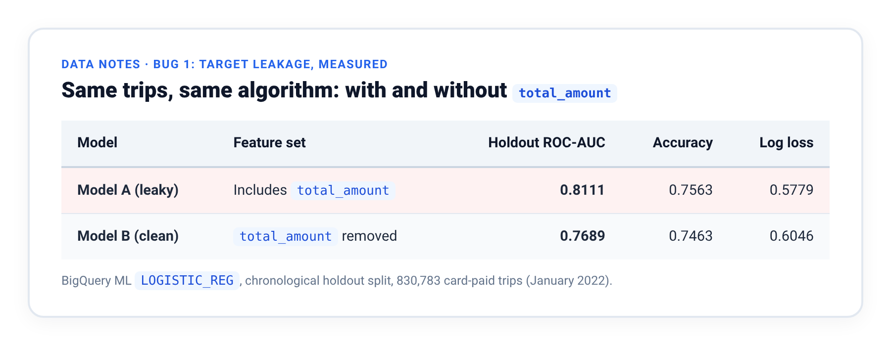
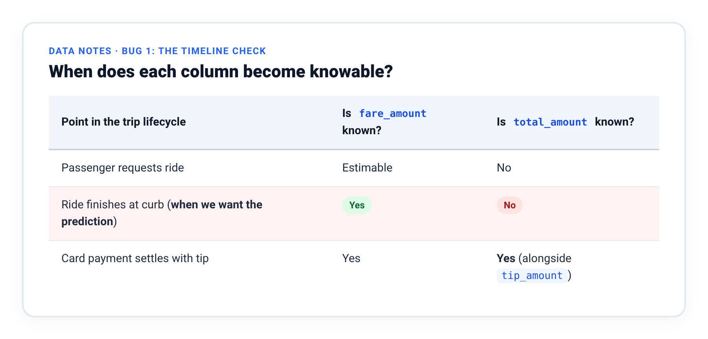
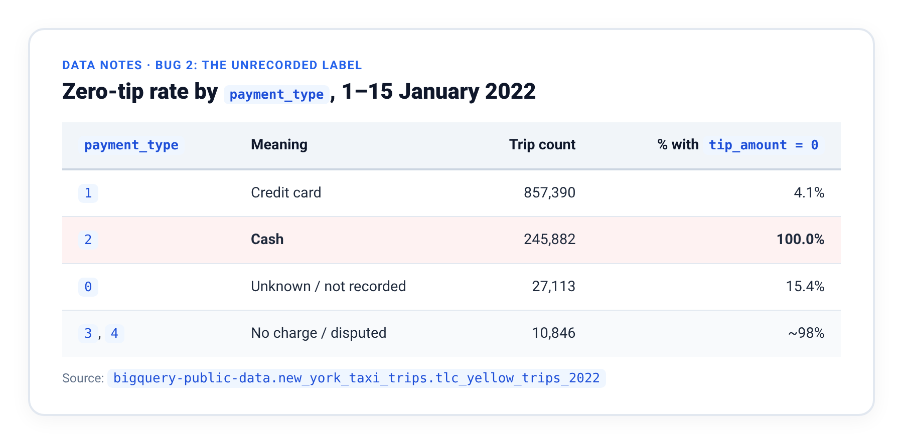

# Data Notes: The NYC Taxi Dataset Behind the Blueprint

This runbook holds the dataset detail behind the [Zero-Cluster MLOps blueprint](https://github.com/Rajdipc/zero-cluster-mlops): the prediction task, the two data bugs found while building it (with the queries, numbers, and SQL fixes), and how the demo keeps receiving fresh partitions. The [README](../README.md) and the companion blog post summarize these points; this file is where they are shown in full.

Everything below runs against the public table `bigquery-public-data.new_york_taxi_trips.tlc_yellow_trips_2022` in the `US` multi-region. Queries that read only the public table can be pasted straight into BigQuery Studio.

**Contents**

1. [The dataset and the prediction task](#1-the-dataset-and-the-prediction-task)
2. [Two data-contract rules](#2-two-data-contract-rules)
3. [Bug 1: target leakage, in full](#3-bug-1-target-leakage-in-full)
4. [Bug 2: the unrecorded label, in full](#4-bug-2-the-unrecorded-label-in-full)
5. [Why `auto_class_weights` is off](#5-why-auto_class_weights-is-off)
6. [Phase 0: keeping the demo alive past day one](#6-phase-0-keeping-the-demo-alive-past-day-one)
7. [Where these rules are enforced](#7-where-these-rules-are-enforced)

---

## 1. The dataset and the prediction task

Suppose a dispatch platform wants to estimate the likelihood that a completed credit-card trip will yield a generous tip (`> $2.00`), helping inform driver incentive and dispatch analytics. We frame this as a **binary classification** task:

* **Target label (`is_high_tip`):** `1` when `tip_amount > 2.00`, otherwise `0`.
* **Features:** `vendor_id` (STRING, used for clustering), `passenger_count` (INT64), `trip_distance` (FLOAT64), and `fare_amount` (FLOAT64, which also serves as our drift canary feature).  
  *(Notice that `total_amount` is absent from this list. Including it in our initial prototype created a subtle target-leakage bug, described in section 3.)*
* **Model:** BigQuery ML Logistic Regression (`LOGISTIC_REG`), trained with a chronological sequential split (`data_split_method = 'SEQ'`) on `pickup_datetime` so future trips never leak into the training fold.
* **Scoring cadence:** A nightly batch job that scores the previous day's partition and writes predictions to a date-partitioned destination table.

---

## 2. Two data-contract rules

Most batch prediction tables fail downstream consumers for mundane data-engineering reasons rather than model choice:

1. **Every prediction row needs a deterministic join key.** The NYC taxi public table does not have a primary key column. If your predictions table only outputs `vendor_id` (which has just 4 distinct values) alongside a predicted probability, the table is effectively write-only: downstream applications have no way to join a prediction back to the specific trip it describes. During ingestion, we synthesize a deterministic surrogate key (`trip_id`) by hashing the natural attributes of the trip:

```sql
TO_HEX(MD5(FORMAT('%t|%t|%s|%t|%t',
  pickup_datetime, dropoff_datetime, vendor_id, trip_distance, total_amount
))) AS trip_id
```

2. **Always partition by the logical date of the data (`scoring_date`), never by the wall-clock time the job ran (`scored_at`).** Why this distinction saves you during backfills is covered in Production Gotcha #1 of the blog post.

---

## 3. Bug 1: target leakage, in full

When we first wired up the feature table for the prototype, we included five input columns: `vendor_id`, `passenger_count`, `trip_distance`, `fare_amount`, and **`total_amount`**. Every SQL query compiled cleanly, unit tests passed, and the code looked completely ordinary in review. Yet `total_amount` leaked the target label directly into the model.

### The arithmetic behind the leak

In the NYC TLC schema, the total amount charged to the passenger is defined as:

```
total_amount = fare_amount + extra + mta_tax + tip_amount
             + tolls_amount + imp_surcharge + airport_fee
```

Meanwhile, our binary target label is:

```
is_high_tip = (tip_amount > 2.00)
```

Because `total_amount` is the sum of `fare_amount`, taxes, surcharges, and **`tip_amount`**, the feature vector contains the exact quantity the model is trying to predict.

### Measuring the leak on 830,000 real trips

If both `total_amount` and `fare_amount` are handed to a model, subtracting one from the other isolates the tip plus a few dollars of fixed taxes and surcharges. Across the **830,783 card-paid trips** in our January 2022 training window, this one-line rule:

```sql
(total_amount - fare_amount) > 5.5
```

reproduces `is_high_tip` with **87.1% accuracy** without training a machine learning model at all.

### How it showed up in BigQuery ML

When we trained two identical BigQuery ML logistic regression models on those same trips—Model A with `total_amount` included, and Model B with `total_amount` removed—here is how they scored on the chronological holdout split:



<details>
<summary>Same table as text</summary>

| Model | Feature Set | Holdout ROC-AUC | Accuracy | Log Loss |
| :--- | :--- | ---: | ---: | ---: |
| **Model A (leaky)** | Includes `total_amount` | **0.8111** | 0.7563 | 0.5779 |
| **Model B (clean)** | `total_amount` removed | **0.7689** | 0.7463 | 0.6046 |

</details>

Notice something surprising: **the ROC-AUC only jumped to 0.81, not 0.99.** Because logistic regression is a regularized linear model, exploiting `total_amount - fare_amount` requires assigning a large positive weight to one column and a large negative weight to a highly collinear column—exactly the pattern that L2 regularization penalizes. A gradient-boosted tree (`BOOSTED_TREE_CLASSIFIER`) would isolate the difference across a few splits and inflate the offline AUC much further.

> ⚠️ **Why a subtle leak is more dangerous than an obvious one:**  
> When a leaked feature pushes offline ROC-AUC to `0.99`, every data scientist in the room gets suspicious and checks the schema. When a leak nudges ROC-AUC from `0.77` to `0.81`, nobody questions it—the model looks respectable, passes review, deploys to production, and then fails when real-time requests arrive before the leaked column is populated.

### The timeline check that catches this immediately

Even without running a query, you can spot target leakage by asking **when** each column becomes knowable in the real world:



<details>
<summary>Same table as text</summary>

| Point in the Trip Lifecycle | Is `fare_amount` known? | Is `total_amount` known? |
| :--- | :--- | :--- |
| Passenger requests ride | Estimable | No |
| Ride finishes at curb (**when we want the prediction**) | **Yes** | **No** |
| Card payment settles with tip | Yes | **Yes** (alongside `tip_amount`) |

</details>

By the moment `total_amount` is recorded, `tip_amount` is already settled and you no longer need a prediction. **If a column is not available at the exact moment a decision is made, it cannot be a feature.**

### Three checks to run on any tabular dataset

1. **Expand every composite column.** Write out the arithmetic definition of any `total_*`, `net_*`, `final_*`, or `_summary` column. If the label or a descendant of the label sits inside the formula, drop the column from your feature view.
2. **Plot columns on an event timeline.** Verify that every feature is recorded *before* the prediction timestamp.
3. **Test a one-line SQL heuristic.** If a simple subtraction or ratio of two features predicts the label with 85%+ accuracy, check whether you are measuring a post-event accounting identity rather than customer behavior.

### How the canonical SQL view enforces the fix

Because training, evaluation, and batch inference all read from a single canonical view (`v_taxi_features`), removing `total_amount` in one file fixed all three stages simultaneously:

```sql
CREATE OR REPLACE VIEW `project.dataset.v_taxi_features` AS
SELECT
  trip_id,
  scoring_date,
  pickup_datetime,
  vendor_id,
  passenger_count,
  trip_distance,
  fare_amount,
  -- total_amount deliberately absent: it contains tip_amount, and the label is
  -- derived from tip_amount. Excluding it HERE removes it from training,
  -- evaluation and inference simultaneously.
  is_high_tip
FROM `project.dataset.taxi_trips_features`
WHERE vendor_id IS NOT NULL
  AND passenger_count > 0
  AND trip_distance > 0
  AND fare_amount BETWEEN 2.50 AND 100.00
  -- Still referenced as a DATA QUALITY predicate. Filtering on a column is not
  -- the same as learning from it: this drops corrupt rows without ever exposing
  -- the value to the model.
  AND total_amount > 0;
```

We keep `total_amount > 0` in the `WHERE` clause as a data-quality filter (dropping corrupt negative-charge records) while excluding `total_amount` from the `SELECT` list so the model never sees its value. A regression test in [`tests/test_config.py`](https://github.com/Rajdipc/zero-cluster-mlops/blob/main/tests/test_config.py) strips SQL comments and verifies that `total_amount` can never be added back to the feature projection:

```python
@pytest.mark.parametrize("template", ["batch_inference.sql", "evaluate_model.sql"])
def test_runtime_consumers_never_select_total_amount(self, monkeypatch, template):
    monkeypatch.setenv("GCP_PROJECT_ID", "p")
    sql = strip_sql_comments(PipelineConfig().load_sql(template))
    assert "total_amount" not in sql, f"{template} selects the leaked column"
```

With the leaked column removed, the honest logistic regression achieves an **ROC-AUC of ~0.77** using only vendor, passenger count, distance, and base fare. That modest score is realistic for four basic trip attributes, so the repository sets `MIN_HOLDOUT_ROC_AUC = 0.60` as its warning floor.

**What about BigQuery ML's `TRANSFORM` clause?** Put stateful preprocessing such as `ML.STANDARD_SCALER` or `ML.QUANTILE_BUCKETIZE` inside `CREATE MODEL ... TRANSFORM(...)` whenever a model needs it, because `TRANSFORM` freezes the training statistics inside the model artifact. This four-feature `LOGISTIC_REG` model does not need it: BigQuery ML already standardizes numeric features and one-hot encodes strings automatically, and leaving `TRANSFORM` out lets passthrough keys such as `trip_id` flow through `ML.PREDICT` without being declared in the model signature.

---

## 4. Bug 2: the unrecorded label, in full

While profiling the January 2022 training window in `bigquery-public-data.new_york_taxi_trips.tlc_yellow_trips_2022`, we grouped the zero-tip rate by `payment_type`:

```sql
SELECT
  CAST(payment_type AS STRING) AS payment_type,
  COUNT(*)                                    AS trips,
  ROUND(COUNTIF(tip_amount = 0)/COUNT(*)*100, 1) AS pct_zero_tip
FROM `bigquery-public-data.new_york_taxi_trips.tlc_yellow_trips_2022`
WHERE DATE(pickup_datetime) BETWEEN '2022-01-01' AND '2022-01-15'
GROUP BY 1 ORDER BY trips DESC
```

Here is what BigQuery returns:



<details>
<summary>Same table as text</summary>

| `payment_type` | Meaning | Trip Count | % with `tip_amount = 0` |
| :--- | :--- | ---: | ---: |
| `1` | Credit card | 857,390 | 4.1% |
| `2` | **Cash** | 245,882 | **100.0%** |
| `0` | Unknown / not recorded | 27,113 | 15.4% |
| `3`, `4` | No charge / disputed | 10,846 | ~98% |

</details>

Look at row `2`: **not 99.8%, but 100.0% across 245,882 trips.** In real human behavior, a quarter of a million riders do not unanimously stiff their taxi drivers.

What you are looking at is an instrumentation artifact: **NYC taxi meters only record tips paid electronically by credit card.** When a passenger hands the driver a $5 bill in cash, the meter has no way of knowing, so the database writes `tip_amount = 0.00`.

### What happens if you leave cash trips in the training set

Those 245,882 cash trips make up **22% of the training window**, and every single one carries the label `is_high_tip = 0` regardless of distance or fare. If you train on them:

* Over a fifth of your training labels are false negatives created by the payment terminal.
* Because `payment_type` is not one of the model features (including it would simply teach the model the trivial rule *"cash means zero"*), those 245,882 rows act as pure label noise, dragging predicted probabilities downward across every trip.

Adding a single label-validity predicate to the canonical view resolves the issue:

```sql
  -- Credit card only. This is a LABEL VALIDITY filter, not a data-cleaning one.
  -- TLC records tip_amount only for card payments; cash tips are always written
  -- as 0.00 because the meter never saw them. That is 22% of the training
  -- window, every row labelled is_high_tip = 0 regardless of the trip.
  AND payment_type = '1';
```

Filtering to credit-card transactions (`payment_type = '1'`) increases the correlation between `trip_distance` and `is_high_tip` from **0.190 to 0.258**—recovering more than a third of the underlying signal simply by excluding rows where the label was never observed.

It also sharpens the business definition of the model. Instead of claiming to answer *"Will this passenger tip?"*, the model answers the question the data can truthfully support: **"Given a credit-card trip, will the tip exceed $2.00?"**

> 💡 **Takeaway for public and enterprise datasets:**  
> Before training a classifier, run a `GROUP BY` of your positive label rate across every major categorical dimension (`payment_type`, `channel`, `region`, `device_type`, `vendor`). Whenever a segment shows **0.0%** or **100.0%**, assume you have found an unrecorded logging path rather than customer behavior.

---

## 5. Why `auto_class_weights` is off

> 💡 **Why `auto_class_weights` is turned off:**  
> On valid credit-card trips in the training window, **61.7% have a tip over $2.00**, so the classes are already balanced. Class weighting would distort the predicted probabilities, and any business rule that multiplies a probability by a dollar amount (such as `P(high tip) * bonus_amount`) needs those probabilities to stay calibrated.

---

## 6. Phase 0: keeping the demo alive past day one

Because the 2022 public dataset is historical, no upstream ETL lands rows for "yesterday". If the seed script only remapped a single historical date to `CURRENT_DATE() - 1`, the first manual run would succeed and the very next night's Cloud Scheduler run would halt with:

```
InsufficientDataException: partition 2022-02-11 has 0 rows (minimum: 1)
```

To keep the demo self-sustaining without weakening the Phase 1 guardrail, the orchestrator includes an optional Phase 0 (`src/ingest.py`). When `ENABLE_DEMO_INGESTION=true` and the target partition is missing, it runs this single-statement query:

```sql
-- sql/ingest_demo_partition.sql (abridged)
INSERT INTO `{project}.{dataset}.{features_table}` (...)
SELECT
  TO_HEX(MD5(FORMAT('%t|%t|%s|%t|%t', pickup_datetime, dropoff_datetime,
                    vendor_id, trip_distance, total_amount))) AS trip_id,
  DATE('{target_date}') AS scoring_date,   -- remapped to the date being scored
  ...
FROM `bigquery-public-data.new_york_taxi_trips.tlc_yellow_trips_2022`
WHERE DATE(pickup_datetime) = DATE_ADD(
        DATE '{window_start}',
        INTERVAL MOD(DATE_DIFF(DATE '{target_date}', DATE '1970-01-01', DAY),
                     {window_days}) DAY)
  AND NOT EXISTS (                          -- never double-load, never clobber
        SELECT 1 FROM `{project}.{dataset}.{features_table}`
        WHERE scoring_date = DATE('{target_date}'))
QUALIFY ROW_NUMBER() OVER (PARTITION BY trip_id) = 1
```

`MOD(DATE_DIFF(...), 28)` maps any current or future date onto a 28-day cycle of February 2022 data (preserving day-of-week patterns), while the `NOT EXISTS` guard ensures the query becomes a zero-row no-op whenever a partition is already populated.

> [!WARNING]
> **Set `ENABLE_DEMO_INGESTION=false` in any real deployment** (`make tf-apply ENABLE_DEMO_INGESTION=false`). With demo ingestion off, a missing upstream partition halts the pipeline with exit code `2`, as designed.

---

## 7. Where these rules are enforced

| Rule | Enforced in |
| :--- | :--- |
| `total_amount` is never a feature, only a quality filter | [`sql/create_tables.sql`](../sql/create_tables.sql) (canonical view) and [`tests/test_config.py`](../tests/test_config.py) |
| Card payments only (`payment_type = '1'`) | [`sql/create_tables.sql`](../sql/create_tables.sql) and [`tests/test_feature_contract.py`](../tests/test_feature_contract.py) |
| `trip_id` join key and `scoring_date` partitioning | [`sql/create_tables.sql`](../sql/create_tables.sql) and [`sql/batch_inference.sql`](../sql/batch_inference.sql) |
| Phase 0 stays single-statement and `NOT EXISTS`-guarded | [`sql/ingest_demo_partition.sql`](../sql/ingest_demo_partition.sql) and [`tests/test_ingest.py`](../tests/test_ingest.py) |
